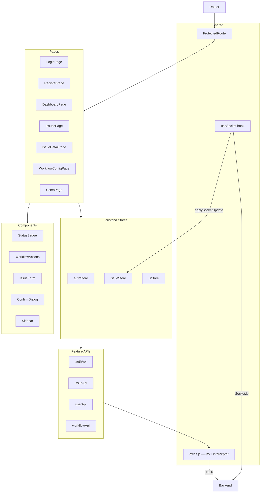

# Novintix Frontend — React Client

React + Vite SPA with Zustand state management, Tailwind CSS, and Socket.io real-time updates.

---

## Architecture



---

## Folder Structure

```
client/src/
├── features/                    # Feature-based modules
│   ├── auth/
│   │   ├── api/authApi.js
│   │   ├── store/authStore.js
│   │   └── pages/LoginPage, RegisterPage
│   ├── issues/
│   │   ├── api/issueApi.js
│   │   ├── store/issueStore.js
│   │   ├── components/
│   │   │   ├── StatusBadge.jsx
│   │   │   ├── WorkflowActions.jsx   ← role-based transition buttons
│   │   │   └── IssueForm.jsx         ← create/edit modal
│   │   └── pages/IssuesPage, IssueDetailPage
│   ├── dashboard/
│   │   └── pages/DashboardPage       ← Recharts pie + bar charts
│   ├── workflow/
│   │   └── pages/WorkflowConfigPage  ← Admin only
│   └── users/
│       └── pages/UsersPage           ← invite + role management
│
└── shared/
    ├── api/axios.js             # Axios instance + JWT interceptor + 401 handler
    ├── components/
    │   ├── layout/
    │   │   ├── AppLayout.jsx    # Sidebar + Outlet
    │   │   └── Sidebar.jsx      # Collapsible, role-filtered nav
    │   ├── ProtectedRoute.jsx   # Auth + role guard
    │   └── ConfirmDialog.jsx    # Reusable delete confirmation modal
    ├── hooks/
    │   └── useSocket.js         # Socket.io connection + tenant room join
    ├── store/
    │   └── uiStore.js           # sidebar open/close
    └── lib/
        └── utils.js             # cn(), formatDate(), getStatusColor()...
```

---

## Setup

```bash
npm install
npm run dev     # → http://localhost:5173
```

---

## State Management — Zustand Stores

| Store        | Manages                                                            |
| ------------ | ------------------------------------------------------------------ |
| `authStore`  | user, token, login(), logout(), register()                         |
| `issueStore` | issues[], selectedIssue, CRUD, transition, AI summary, socket sync |
| `uiStore`    | sidebar open/close toggle                                          |

---

## Real-time Flow

```
1. User logs in → useSocket(tenantId) starts
2. Socket connects → emits joinTenant(tenantId)
3. Server: socket.join(tenantId room)
4. Another user transitions an issue
5. Server emits issueUpdated → all clients in room
6. useSocket callback → issueStore.applySocketUpdate()
7. Zustand rerender → UI updates instantly
```

---

## Key Component Patterns

### ProtectedRoute — role guard

```jsx
<ProtectedRoute roles={["Admin"]}>
  <WorkflowConfigPage />
</ProtectedRoute>
```

### WorkflowActions — role-based transitions

- Reads current `issue.status` and user's `role`
- Only shows buttons for allowed transitions
- Calls `issueStore.transitionStatus()` with toast feedback

### ConfirmDialog — reusable modal

```jsx
<ConfirmDialog
  open={!!deleteTarget}
  title="Delete Issue"
  message="Are you sure?"
  confirmLabel="Delete"
  loading={deleteLoading}
  onConfirm={handleDeleteConfirm}
  onCancel={() => setDeleteTarget(null)}
/>
```
